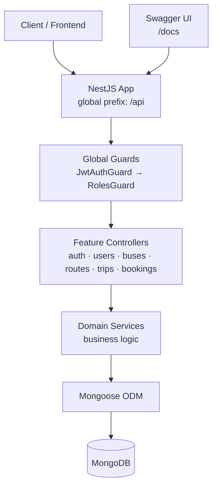
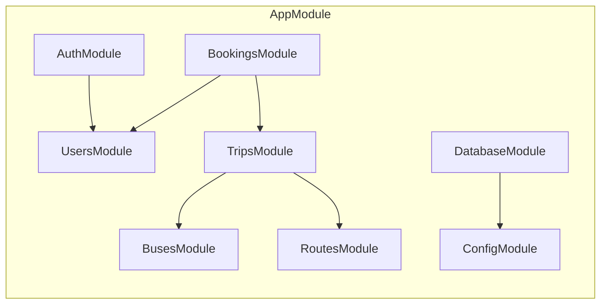
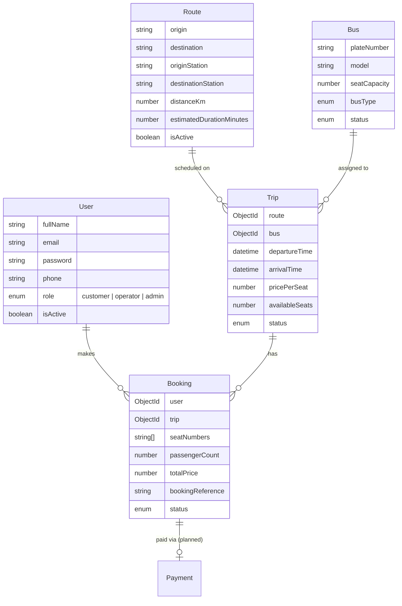
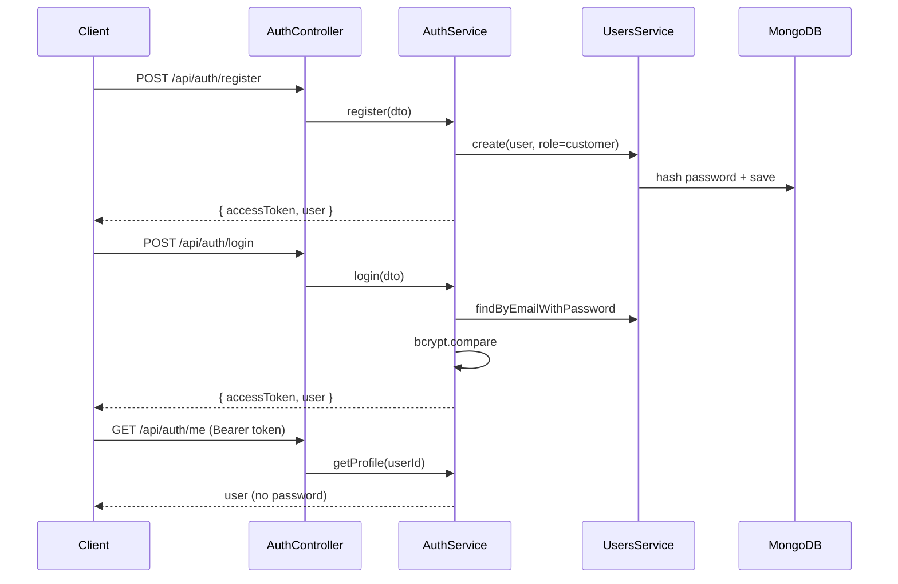
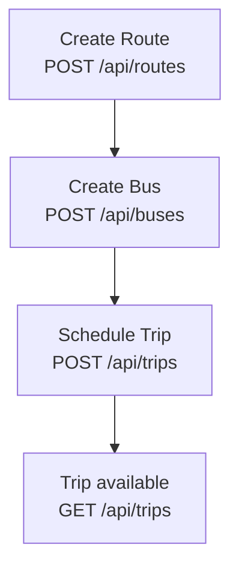
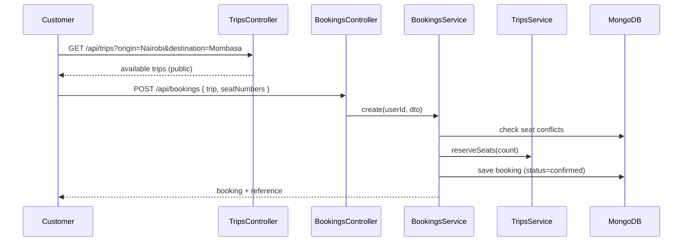

# Bus Booking Backend

NestJS REST API for a bus ticket booking platform. Operators schedule trips on routes using a fleet of buses; customers search trips and book seats. Authentication is JWT-based with role-based access control.

## Tech Stack


| Layer      | Technology                                                   |
| ---------- | ------------------------------------------------------------ |
| Framework  | [NestJS 11](https://nestjs.com/)                             |
| Database   | [MongoDB](https://www.mongodb.com/)                          |
| ODM        | [Mongoose 9](https://mongoosejs.com/) via `@nestjs/mongoose` |
| Auth       | JWT + Passport (`passport-jwt`, `bcrypt`)                    |
| Validation | `class-validator` + `class-transformer`                      |
| API Docs   | Swagger (`@nestjs/swagger`)                                  |
| Monorepo   | [Nx](https://nx.dev/)                                        |


---


## Architecture

High-level view of how a request moves through the system:




### Module layout

Each domain is a self-contained NestJS feature module:

```
src/
├── main.ts                 # Bootstrap, ValidationPipe, Swagger
├── app/                    # Root module + health check
├── config/                 # Env config + Joi validation
├── database/               # Mongoose connection
├── common/                 # Shared guards, decorators, interfaces
└── modules/
    ├── auth/               # Register, login, JWT strategy
    ├── users/              # User CRUD (admin)
    ├── buses/              # Fleet management
    ├── routes/             # Origin → destination templates
    ├── trips/              # Scheduled departures
    ├── bookings/           # Seat reservations
    └── payments/           # Schema only (not wired yet)
```




---


## Domain Model

Entities and how they relate:




**Key design decisions**

- **Route vs Trip** — A route is a reusable template (e.g. Nairobi → Mombasa). A trip is one scheduled run on a specific date with a specific bus.
- **Seat inventory on Trip** — `availableSeats` lives on the trip document and decrements on booking, so concurrent reservations don't lock the bus document.
- **Booking reference** — Human-readable code (`BB-XXXXXX`) separate from MongoDB `_id`, for support and confirmations.
- **Payments** — Schema exists under `modules/payments/` but is not registered in `AppModule` yet. Bookings are auto-confirmed without payment for now.

---


## Design Flows


### 1. Authentication flow




Every protected request passes through global guards:

1. `JwtAuthGuard` — Validates Bearer token unless route is marked `@Public()`.
2. `RolesGuard` — Checks `@Roles(...)` metadata against the user's role.


### 2. Operator setup flow

Operators and admins prepare inventory before customers can book:




When a trip is created:

- Route and bus must exist; bus must be `active`.
- `availableSeats` defaults to the bus `seatCapacity`.
- `arrivalTime` must be after `departureTime`.


### 3. Customer booking flow




On cancellation (`PATCH /api/bookings/:id/status` → `cancelled`):

- Seats are released back to the trip via `releaseSeats`.
- Only active bookings (`pending` / `confirmed`) restore inventory.

---


## Roles & Permissions


| Action                             | Public | Customer   | Operator | Admin |
| ---------------------------------- | ------ | ---------- | -------- | ----- |
| Register / Login                   | ✓      |            |          |       |
| Health check `GET /api`            | ✓      |            |          |       |
| Browse buses, routes, trips        | ✓      | ✓          | ✓        | ✓     |
| Create/update buses, routes, trips |        |            | ✓        | ✓     |
| Delete buses, routes, trips        |        |            |          | ✓     |
| Book seats                         |        | ✓          |          |       |
| View own bookings                  |        | ✓          |          |       |
| View all bookings                  |        |            | ✓        | ✓     |
| Update booking status              |        | cancel own | ✓        | ✓     |
| User management                    |        |            |          | ✓     |


**Bootstrap first admin** — Register via `/api/auth/register`, then promote in MongoDB:

```js
db.users.updateOne(
  { email: "you@example.com" },
  { $set: { role: "a dmin" } }
)
```

---


## API Reference

Base URL: `http://localhost:3000/api`  
Interactive docs: `http://localhost:3000/docs`

### Auth


| Method | Path             | Auth   | Description             |
| ------ | ---------------- | ------ | ----------------------- |
| POST   | `/auth/register` | Public | Create customer account |
| POST   | `/auth/login`    | Public | Get JWT                 |
| GET    | `/auth/me`       | JWT    | Current profile         |


### Users


| Method | Path         | Auth         | Description            |
| ------ | ------------ | ------------ | ---------------------- |
| POST   | `/users`     | Admin        | Create user (any role) |
| GET    | `/users`     | Admin        | List users             |
| GET    | `/users/:id` | Admin / self | Get user               |
| PATCH  | `/users/:id` | Admin / self | Update user            |
| DELETE | `/users/:id` | Admin        | Delete user            |


### Buses


| Method | Path         | Auth      | Description |
| ------ | ------------ | --------- | ----------- |
| GET    | `/buses`     | Public    | List buses  |
| GET    | `/buses/:id` | Public    | Get bus     |
| POST   | `/buses`     | Operator+ | Create bus  |
| PATCH  | `/buses/:id` | Operator+ | Update bus  |
| DELETE | `/buses/:id` | Admin     | Delete bus  |


### Routes


| Method | Path          | Auth      | Description                                |
| ------ | ------------- | --------- | ------------------------------------------ |
| GET    | `/routes`     | Public    | List routes (filter by origin/destination) |
| GET    | `/routes/:id` | Public    | Get route                                  |
| POST   | `/routes`     | Operator+ | Create route                               |
| PATCH  | `/routes/:id` | Operator+ | Update route                               |
| DELETE | `/routes/:id` | Admin     | Delete route                               |


### Trips


| Method | Path         | Auth      | Description                      |
| ------ | ------------ | --------- | -------------------------------- |
| GET    | `/trips`     | Public    | Search trips                     |
| GET    | `/trips/:id` | Public    | Get trip (populated route + bus) |
| POST   | `/trips`     | Operator+ | Schedule trip                    |
| PATCH  | `/trips/:id` | Operator+ | Update trip                      |
| DELETE | `/trips/:id` | Admin     | Delete trip                      |


### Bookings


| Method | Path                   | Auth     | Description    |
| ------ | ---------------------- | -------- | -------------- |
| POST   | `/bookings`            | Customer | Book seats     |
| GET    | `/bookings`            | JWT      | List bookings  |
| GET    | `/bookings/:id`        | JWT      | Get booking    |
| PATCH  | `/bookings/:id/status` | JWT      | Update status  |
| DELETE | `/bookings/:id`        | Admin    | Delete booking |


---


## Getting Started


### Prerequisites

- Node.js 20+
- MongoDB running locally or a MongoDB Atlas URI


### Environment

Copy the example env file:

```bash
cp apps/backend/.env.example apps/backend/.env
```


| Variable         | Required | Description                           |
| ---------------- | -------- | ------------------------------------- |
| `NODE_ENV`       | No       | `development` / `production` / `test` |
| `PORT`           | No       | Server port (default `3000`)          |
| `MONGODB_URI`    | Yes      | MongoDB connection string             |
| `JWT_SECRET`     | Yes      | Secret for signing JWTs               |
| `JWT_EXPIRES_IN` | No       | Token lifetime (default `1d`)         |


### Run

From the monorepo root:

```bash
# Install dependencies
npm install

# Start dev server
npx nx serve backend
```

Other tasks:

```bash
npx nx run @org/backend:build
npx nx run @org/backend:test
npx nx run @org/backend:lint
```


### Quick test via Swagger

1. Open [http://localhost:3000/docs](http://localhost:3000/docs)
2. `POST /api/auth/register` — create a customer
3. Copy `accessToken` from the response
4. Click **Authorize** → paste `Bearer <token>`
5. Try protected endpoints

---


## Project Conventions

- **DTOs** — Request validation with `class-validator`; Swagger decorators on the same classes.
- **Schemas** — Mongoose classes in `modules/*/schemas/` using `@nestjs/mongoose` decorators.
- **Guards** — Applied globally; opt out with `@Public()`, restrict with `@Roles()`.
- **Passwords** — Hashed with bcrypt (10 rounds); excluded from queries via `select: false`.
- **Errors** — Standard NestJS exceptions (`NotFoundException`, `ConflictException`, etc.).

---


## Roadmap

- [ ] **Payments module** — Wire schema, link to bookings, payment status webhooks
- [ ] **Seed script** — Sample routes, buses, trips for development
- [ ] **Pagination** — List endpoints currently return full result sets
- [ ] **E2E tests** — API integration tests against a test database